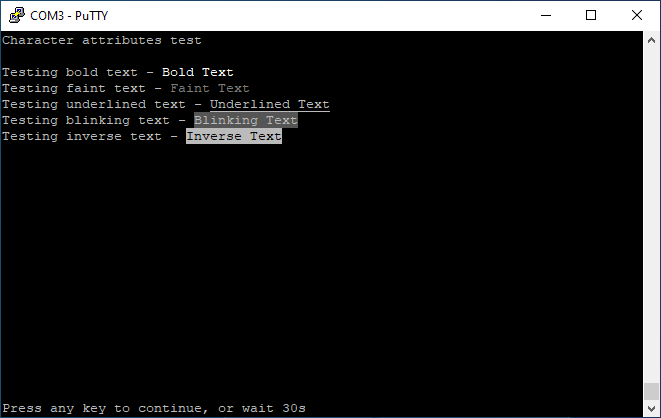
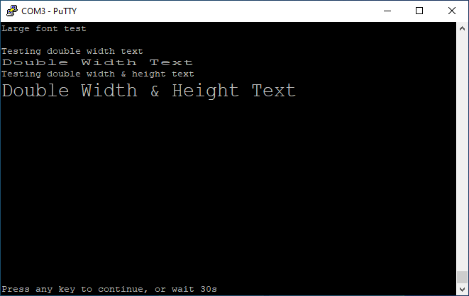
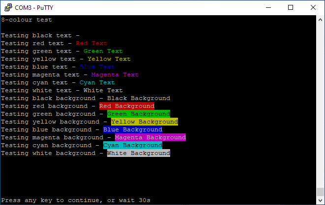
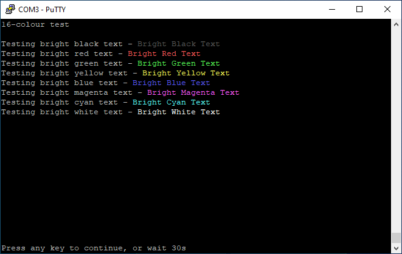
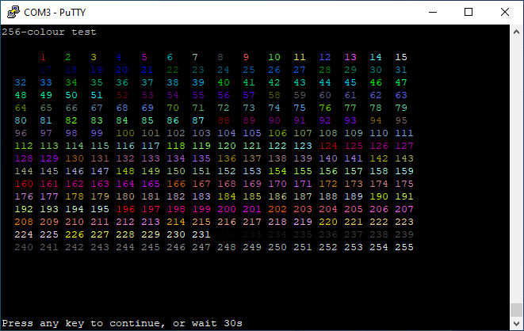
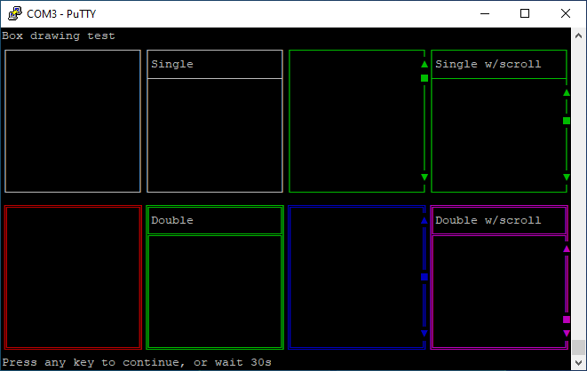
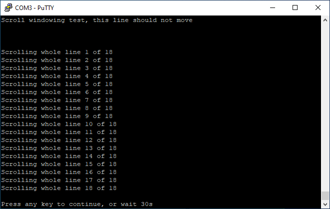
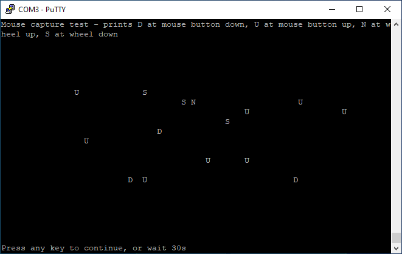

# Terminal capability tests

This example tests the basic capabilities of the terminal emulator so you can be sure it will work with this library. Upload it to your target microcontroller then connect on the serial port at 115200 baud.

The pictures below are how it should appear, using PuTTY as the benchmark. Please upload this sketch before trying any others.

## Probing test

This test checks if the library can probe the size of the window. It does this by moving the cursor to 256,256 then requesting the current cursor position. Currently the terminal type is requested but not actively used.

## Character attributes test

This test checks for basic terminal attributes. Notably PuTTY styles blinking text but it doesn't actually blink.

## Large font test

This test checks for the ability to render large fonts. These are hard to use effectively in PuTTY as they override the whole line and when drawing double height it is two lines made of a 'top half' and a 'bottom half' mode. Nonetheless you *can* use them with care.

## 8-colour test

This tests the most basic foreground and background colours.

## 16-colour test

This tests the combination of the basic eight colours with 'bright'.

## 256-colour test

This tests the 256 colour foreground palette, which is useful in non-widget areas but not yet supported in widgets.

## Box drawing test

This test checks that the terminal emulator and system support the Unicode characters used for drawing boxes and scrollbars.

## Scroll windowing test

This test checks that the 'scroll window' can be set, which means only a portion of the window scrolls when text overflows or there is a newline. This scrolls the whole width so is not used in widgets, but can be very useful outside of widgets for 'logging' data.

## Mouse capture test

Make sure you can use the mouse in the terminal window. Only the primary button and mouse wheel are supported.